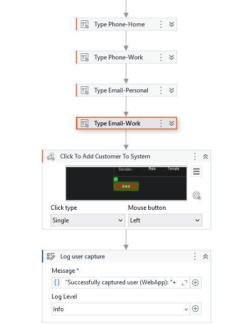
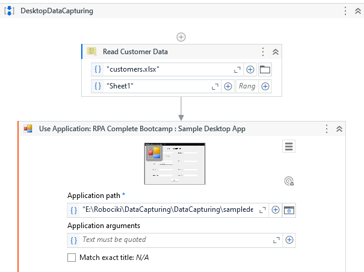
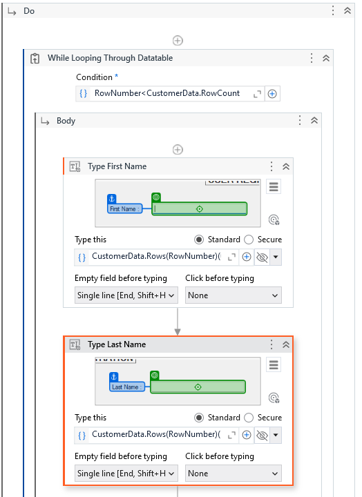
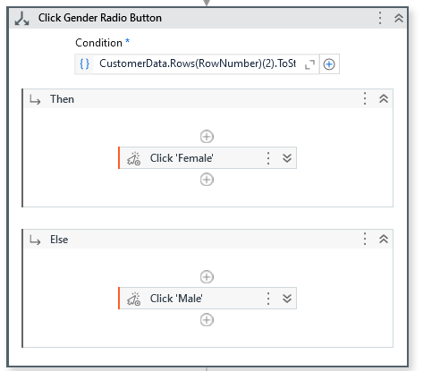
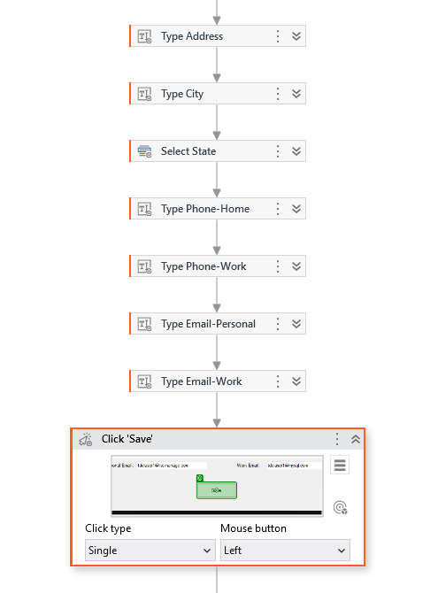
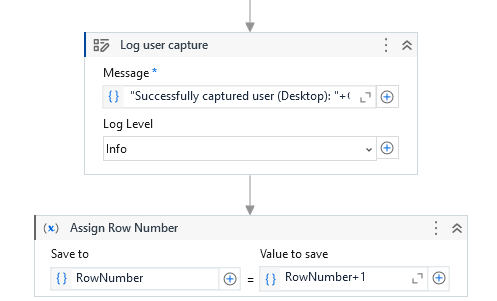

# RobotyUiPath
 Portfolio prezentujące moje dotychczasowe projekty dotyczące automatyzacji RPA; zarowno prostsze prace jak i te bardziej zaawansowane
 Opis każdego robota znajduje się poniżej.

## Pogodynka

**1.GetCityName**

Odpowiada za pobranie od użytkownika danych, w tym przypadku nazwy miasta, dla którego sprawdzana będzie pogoda.

**1.2 Write Line CityName**

Do sprawnego prowadzenia debugu :).

**2. Use Browser Edge: Google**

Ta część odpowiada za zdefiniowanie adresu URL i pozostałych czynności.

***Do***
W tej części wybieram odpowiedni element przeglądarki przy użyciu *TypeInto* i ustawiam odpowiednie parametry, aby czynność była poprawna.

***Search, get, log***

W tym miejscu za pomocą *Click, GetText, LogMessage* naprowadzam robota do wyszukania rekordu, pobrania i skopiowania temperatury ze wskazanego elementu, zapisania go do zmiennej oraz utworzenia logów do konsoli.

***GetTypeOfWeather, log***

Następnie ponownie przy użyciu *GetText, LogMessage* pobieram dane dotyczące opisu pogody wraz z utworzeniem logu do konsoli.

**3. Analyze**

Ta sekcja odpowiada za logikę całej automatyzacji, na podstawie zapisanego kodu w *FlowDecision* kod stwierdza czy dana wartość jest *True* czy *False* i wybiera odpowiednią sugestie za pomocą *Assign* i zmiennej OutfitSuggestion.

**4. Display**

Koniec, funkcja odpowiadająca za zwrócenie informacji użytkownikowi.

## DataCapturing
Automatyzacja na podstawie bazy danych Klientów *customers*, robot pobiera dane z pliku i następnie dodaje je w aplikacji webowej CRM (https://www.theautomationchallenge.com/crm) oraz desktopowej.

**1. Main**

Za pomocą *Parallel* łącze dwa workflows co pozwala na uruchomienie obu automatyzacji.

**2. WebDataCapturing**

W tej części automatyzowana jest wersja webowa aplikacji, za pomocą *ReadRange* pobieram dane z pliku, następnie wybieram przeglądarke i ustanawiam URL. 
W dalszej części używam *ForEachRow* i tworzę zmienną.

Używając *TypeInto* wskazuje miejsca, w jakie mają być wpisane poszczególne dane z bazy, wszystko konwertuje do *String* aby uniknąć błędu.

Przy użyciu *If*, robot sprawdza, czy w kolumnie nr 2 "gender" jest słowo *Female*, na podstawie tego dokonuje wyboru i przy użyciu *Click* wybiera odpowiednią opcję.

Za pomocą kolejnych *TypeInto* i *SelectItem* wskazuję pola do wpisania prawidłowych danych oraz zajmuję się rozsuwaną listą.

*TypeInto*, *Click*, *LogMessage* - kolejne miejsca do wpisania danych, na zakończenie robot finalizuje czynność dodając rekord do CRM i wysyła do logów poniższą informację.

**3. WebDataCapturing**

W tej części automatyzowana jest wersja desktopowa aplikacji, za pomocą *ReadRange* pobieram dane z pliku, następnie wybieram apke z jakiej mam skorzystać. 

Używając pętli *While* zapętlam czynność. Przy użyciu *TypeInto* wskazuję miejsca do wpisywania danych.

*If* - wybór odpowiedniej opcji.

*Type*, *Click* - wprowadza i zapisuje dane.

*LogMessage*, *Assign* - zapisuje poniższą informację do outputu i dodaję +1 do rekordu, aby mógł przejść do kolejnych wartości.

## Rupert

Robot zrealizowany w celu ukończenia wyzwania automatyzacji, które polegało na wprowadzeniu danych z pliku xlsx w pola, które za każdym razem zmieniały swoją pozycję na ekranie, 50 etapów, 350 pól.
Certyfikat ukończenia dostępny pod tym linkiem: [Certyfikat](https://www.theautomationchallenge.com/profile/%C5%82ukasz-1710590709558x600910155729135000)

Użyta solucja: *TryCatch*, która pozwoliła na ponownie zlokalizowanie obiektu.
